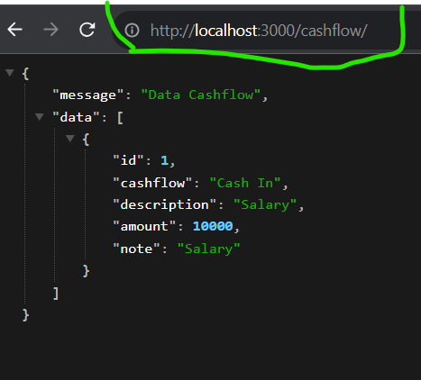
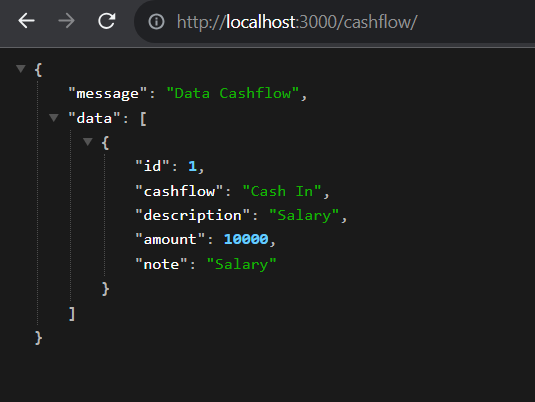

# Backend Cashflow Database

This is my first backend project and this is about database Cashflow we can Create, Read, Update and Delete A.K.A CRUD.
I used this tool for my backend project.

     


# Step by Step How to Use this Code and How to Create this Code

## Clone the Repo

first step you just have to clone the repository and dont forget to write npm install on terminal so you can run the code directly. you can see what you need on package.json like this below.

```
{
  "name": "week-8-hill-man-1",
  "description": "[](https://classroom.github.com/a/sRKW9Tsr)",
  "version": "1.0.0",
  "main": "src/app.js",
  "type": "commonjs",
  "scripts": {
    "start": "node src/app.js",
    "test": "echo \"Error: no test specified\" && exit 1",
    "dev": "concurrently \"npx tsc --watch\" \"nodemon src/app.js\""
  },
  "author": "",
  "license": "ISC",
  "dependencies": {
    "@types/body-parser": "^1.19.2",
    "pnpm": "^8.6.12",
    "typescript": "^5.1.6"
  },
  "devDependencies": {
    "@types/dotenv": "^8.2.0",
    "@types/express": "^4.17.17",
    "@types/node": "^20.4.9",
    "concurrently": "^8.2.0",
    "dotenv": "^16.3.1",
    "express": "^4.18.2",
    "nodemon": "^3.0.1"
  }
}
```

## Dependencies

Before we build the data we have to install some dependencies here is the dependencies and devdependencies i usesd for this project.


### Red Square
the red square is Devdependencies i used. what is devdependencies? devDependencies are modules which are only required during development. only install what you need during the development process, don't install everything on devdepencies because the files will be large.

### Green Square
the green square is Dependencies i used. what is Dependencies? dependencies are modules which are also required at runtime. So while development we use both of them. same like Devdependencies only install what you need during the development process, don't install everything on devdepencies because the files will be large

## Create .ENV file
first code you have to put your port on .ENV file. just create a new one with name .ENV and put your port into it. like this :

```
PORT=3000
```

it mean after you write code on js files you can run the code on port 3000. its really hard to tell but you can see about what im write before on next step.

## Create a New JS File

so create a new JS file with the following code. you will see import and export things so what is export and import?
*EXPORT* The export keyword is used to expose functions, classes, variables, or other entities from a module. When you mark an entity with export, it becomes accessible to other modules that want to use it.
*IMPORT* The import keyword is used to bring functionality from other modules into the current module. This allows you to use code defined in other files as if it were defined in the current file.

```typescript
import express from 'express';
import bodyParser from 'body-parser';
import routers from './routes';
import dotenv from 'dotenv';


dotenv.config();

const app = express();
const port = process.env.PORT || 3000;

app.use(bodyParser.json());
app.use(routers);
app.listen(port, () => {
    console.log(`Cashflow app listening on port ${port}`);
});

```

after you write the code like this you can run the code on terminal and dont forget to compile the file because this file is typescript and we will run javascript file. so write this below

```terminal
tsc app.ts
```

```terminal
node app.js
```

if you see this it mean you can open your browser and type http:/localhost:3000 but we will see empty browser because we dont have anything on the file but we will put some code to run and will see something.


## Create a New JavaScript File for Put the Data

so now i create a 3 files first is for put the data, interface about data and route the website.

### Interface.ts

this is interface file. in this interface i will make type data for the data so if we want to put name and type data is string we can write like this :

```typescript
interface ICashflow {
    id: number;
    cashflow: string;
    description: string;
    amount: number;
    note: string;
}

export default ICashflow;
```

that mean we can put anything but dont forget to put type data or it will be error


### Routes.ts

in this section we will give the website the route to our data. as you can see this "/" mean home page and if you want to make a new route you just put /cashflow then if you want to see the data you need to do like this.

this is the code
```typescript
import express, {Response,Request} from 'express';
import bodyParser from 'body-parser';
import ICashflow from '../interface/interface';
import data from './data'


const router = express.Router();

let cashFlows: ICashflow[] = data
    
    router.get('/', (req: express.Request, res: express.Response) => {
        res.json("This is a Web About Cashflow");
    });  
    
    router.get('/cashflow', (req: express.Request, res: express.Response) => {
        res.json({
            message : "Data Cashflow",
            data: cashFlows});
    });  
    
    router.get('/cashflow/:id', (req: express.Request, res: express.Response) => {
        const id = parseInt(req.params.id);
        const cashflow = cashFlows.find((p) => p.id === id);
        if(cashflow){
            res.json({
                message: "This Data Cashflow Get By ID",
                data : cashflow});
        }else{
            res.status(404).json({message:'Cashflow not found'});
        }
    });
    
    router.post('/cashflow', (req: express.Request, res: express.Response) => {
        const newCashflow: ICashflow = {
            id: cashFlows.length + 1,
            cashflow: req.body.cashflow,
            description: req.body.description,
            amount: req.body.amount,
            note: req.body.note,
        };
        cashFlows.push(newCashflow);
        res.status(200).json({
            message : "Added to Data Cashflow",
            data: newCashflow});
    })
    
    router.put('/cashflow/:id', (req: express.Request, res: express.Response) => {
        const id = parseInt(req.params.id);
        const cashFlowIndex = cashFlows.findIndex((p) => p.id === id);
        if (cashFlowIndex !== -1){
            const updateCashFlow : ICashflow = {
                id,
                cashflow: req.body.cashflow,
                description: req.body.description,
                amount: req.body.amount,
                note: req.body.note,
        };
        cashFlows[cashFlowIndex] = updateCashFlow;
        res.json({message: "Updated cashflow", data: updateCashFlow});
    }else{
        res.status(404).json({message: "Cash Flow Not Found"})
    }
});

    router.delete('/cashflow/:id', (req: express.Request, res: express.Response) =>{
        const id = parseInt(req.params.id);
        const cashFlowIndex = cashFlows.findIndex((p) => p.id === id);
        if (cashFlowIndex !== -1) {
            const deleteCashFlow = cashFlows.findIndex((p) => p.id === id);
            if (cashFlowIndex !==-1){
                const deleteCashFlow = cashFlows.splice(cashFlowIndex,1)[0];
                res.json({message: "Deleted", data: deleteCashFlow});
        } else {
            res.status(404).json({message: "Cash Flow Not Found"})
        }
    }
});


export default router;
```

and this is the preview about website route (i use to get the data using http://localhost:3000/cashflow/)




and this is the preview about website route get data by id  (i use to get the data using http://localhost:3000/cashflow/)


you can see another page like a get, put, delete by seeing the route i write

###  Data.ts

this is data file. this is an example data i write the code like this

```typescript
const data = [
    {
        id: 1,
        cashflow: "Cash In",
        description: "Salary",
        amount: 10000,
        note: "Salary"},
    ];

export default data;
```

as you can see i write this code to put example data so we can see the data on our web browser and it will look like this



# Credit
here is the link deployment for assignment this week you can try it dont forget to used postman for make it easier
[DATA CASHFLOW](https://week-8-hill-man-1-production-e0b5.up.railway.app/cashflow)